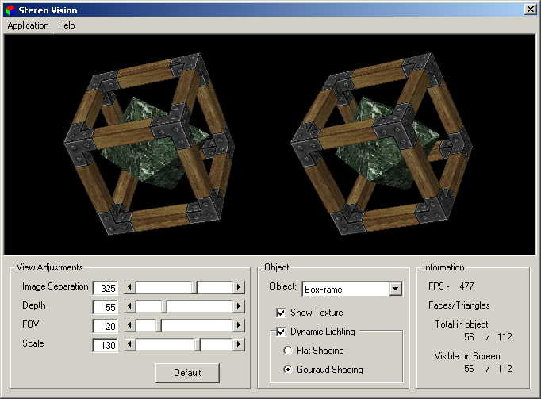



## Stereo Vision, TRUE 3D\! \*Minor Update\*

### Description

Update: Added option to allow viewing model using a cross eyed method, as well as the original "wall eyed" method.  

This program renders two images of a simple model from separate camera positions. When viewed similar to a Stereogram image it produces a TRUE 3 Dimensional view of an object. No special viewing devices are needed to view in full 3D. (See the help file for how to view it properly.)  

This example uses custom D3DTLVertex (Transformed and Lit Vertices) for rendering. The program is responsible for the transforming and lighting of the 3D scene and only sends the screen coordinates, rhw, and color of each vertex to D3D for rendering.  

This program implements most functions needed for 3D rendering in SOFTWARE including:  

3D Object Rotation using 3X3 Matrix Transformation  Surface Normals  Backface Culling  3D Projection to 2D screen  Z Sorting  Dynamic Lighting (Flat Shading and Gouraud Shading.) 
 
### More Info
 

             |
---                |---
**Submitted On**   |2001-01-09 23:23:06
**By**             |[Dennis C\. Urie](https://github.com/Planet-Source-Code/PSCIndex/blob/master/ByAuthor/dennis-c-urie.md)
**Level**          |Advanced
**User Rating**    |4.9 (163 globes from 33 users)
**Compatibility**  |VB 5\.0, VB 6\.0
**Category**       |[DirectX](https://github.com/Planet-Source-Code/PSCIndex/blob/master/ByCategory/directx__1-44.md)
**World**          |[Visual Basic](https://github.com/Planet-Source-Code/PSCIndex/blob/master/ByWorld/visual-basic.md)
**Archive File**   |[CODE\_UPLOAD13600192001\.zip](https://github.com/Planet-Source-Code/dennis-c-urie-stereo-vision-true-3d-minor-update__1-14269/archive/master.zip)

